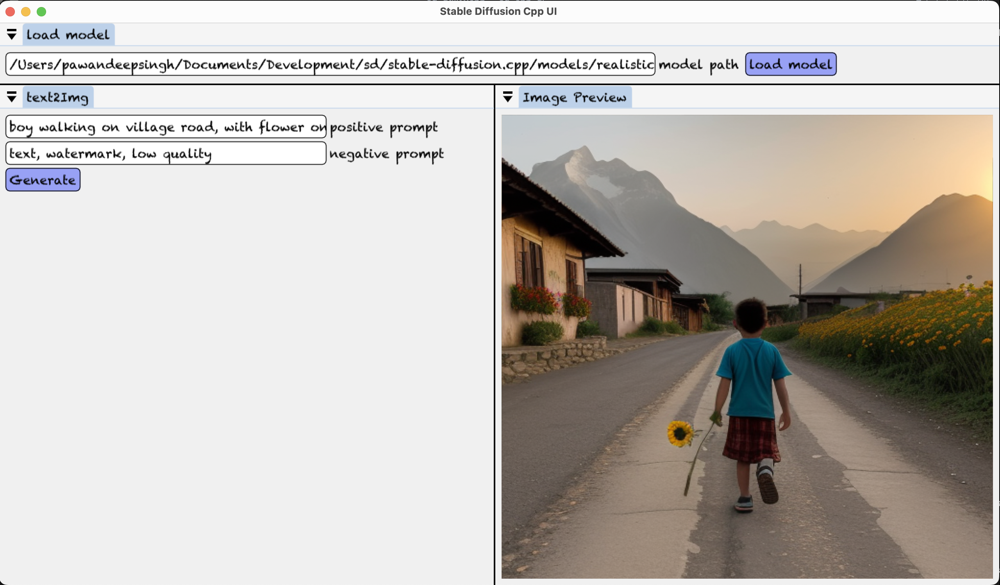

# sd-cpp-ui: Simple UI for Stable Diffusion C++ Models 🚀

## Introduction 📌

Welcome to the sd-cpp-ui project, a straightforward and user-friendly graphical user interface (UI) for the latest Stable Diffusion C++ models. This UI has been exclusively crafted using C++ and ImGui, making it accessible for everyone.

## Motivation 🌟

The motivation behind this project stemmed from the lack of a native C++ UI for the Stable Diffusion C++ models. As a personal hobby, I embarked on the journey of creating an application in C++. While the current codebase might appear somewhat complex, I plan to restructure it in the near future. I'm also in the process of learning ImGui, and I welcome contributions from the community to enhance and expand this project.

## UI Features 🎨



1. **User Interface**: The UI is built using the Dear ImGui library, specifically the docking branch.
2. **Customization**: Since the docking branch is utilized, you can easily rearrange and move frames as per your preference.
3. **Simplicity**: The current UI is intentionally kept minimal and straightforward, with plans for future updates.
4. **Community Contributions**: Contributions from the community are highly encouraged. Feel free to make changes and submit pull requests.

## Current Features 🌟

The current version of the UI offers the following features:

1. **Model Loading**: You can load a model by providing its path.
2. **Text-to-Image**: Generate images from text inputs.
3. **Prompts**: Provide both positive and negative prompts.
4. **Image Preview**: View the generated image preview.

## To-Do List 📋

Here's what's on the horizon for this project:

- [ ] Support for image2image
- [ ] Make code more readable
- [ ] Remove redundant code parts
- [ ] Test on Windows and Linux

## Tested Platforms 🖥️

As of now, the application has been tested on the following platform:

- macOS M1 with 8GB RAM

## Requirements 📦

To use this application, you'll need the following:

1. A laptop or PC with at least 8GB of RAM.
2. A C++ development environment.
3. GLFW and OpenGL 3.

## Installation 🛠️

To get started with sd-cpp-ui, follow these steps:

1. **Install Dependencies**:

   - Ensure you have the following dependencies installed based on your operating system:
     - **CMake**
     - **Make**
     - **GLFW**
     - **OpenGL 3**

2. **Clone the Repository**:

   ```sh
   git clone https://github.com/Pawandeep-prog/sd-cpp-ui.git
   ```

3. **Navigate to the Project Directory**:

   ```sh
   cd sd-cpp-ui
   ```

4. **Create a Build Directory**:

   ```sh
   mkdir build && cd build
   ```

5. **Run CMake**:

   ```sh
   cmake ..
   ```

6. **Build the Project**:

   ```sh
   make
   ```

7. **Navigate to the Binary Directory**:

   ```sh
   cd bin
   ```

8. **Run the Application**:
   ```sh
   ./sd_ui
   ```

Follow these steps to set up and launch the sd-cpp-ui application on your system. Make sure to have all the required dependencies installed before proceeding with the installation.

Feel free to contribute, report issues, or help improve this project. Together, we can make sd-cpp-ui an even more accessible and powerful tool for working with Stable Diffusion C++ models. 💪
